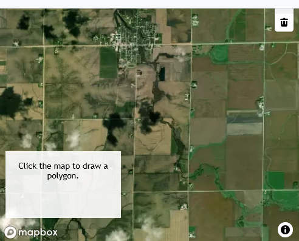

# Slope Route | Mapbox-REACT 

| Desc | Link |
| ----------- | ----------- |
|Code  | https://github.com/attila5287/drone-route-slope |
|**REACT version** | https://drone-route-slope.vercel.app/ |
|Pure-JS version  | https://attila5287.github.io/flight-route-3d/ |

## Brief Requirements
> User will draw a line
> Renders *Blue*  Extrusion Layer with def vals 
> Renders *Green* Line Layer with def vals
> User input changes, renders related layer

|Example|Ref|--|
|--|--|--|
|Draw polygon   | (base)    |https://docs.mapbox.com/mapbox-gl-js/example/mapbox-gl-draw/|
|Extrude Polygon| (building)|https://docs.mapbox.com/mapbox-gl-js/example/3d-extrusion-floorplan/|
|Elevated Line  | (route)   |https://docs.mapbox.com/mapbox-gl-js/example/elevated-line/|

### Original Pure-JS Code

### Mapbox example as a starting point

### Mapbox example to extrude blue solid body

### Mapbox example to create 3-d line path

